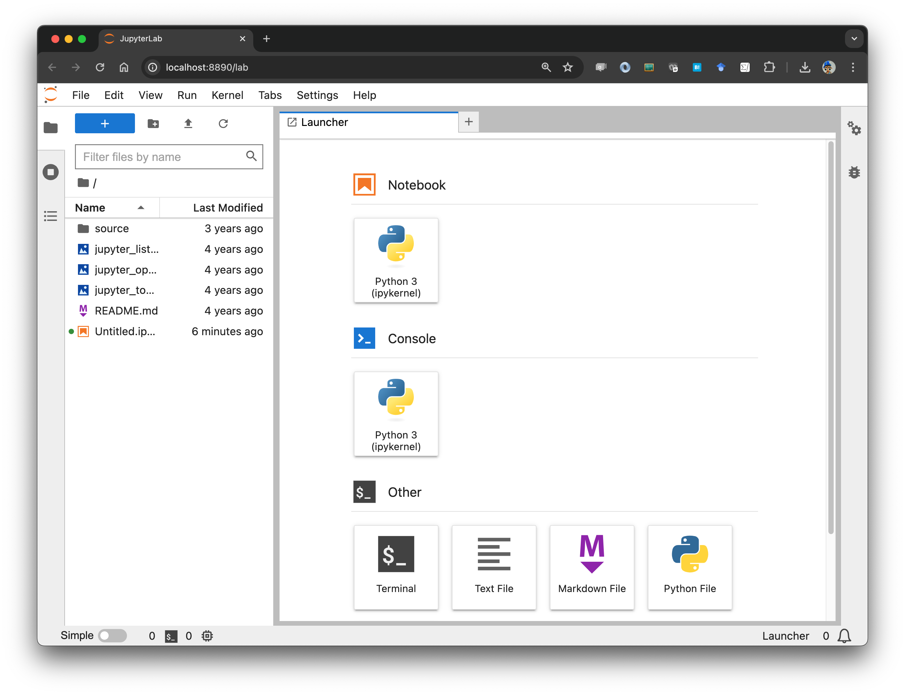
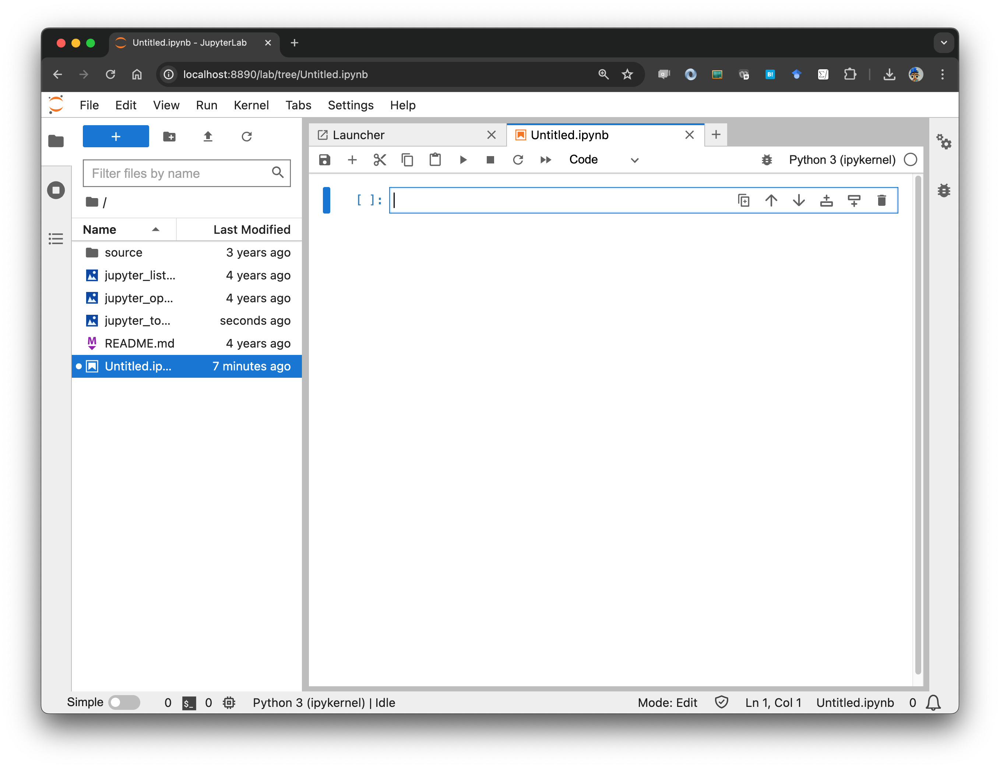
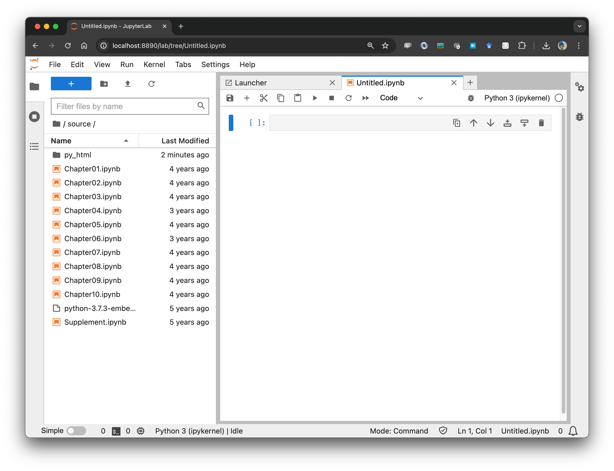

# [「Pythonで学ぶアルゴリズムとデータ構造」](https://www.kspub.co.jp/book/detail/5178034.html)公開資料

## Pythonの環境構築

Pythonは[PSF（Python Software Foundation）](https://www.python.org/)によって管理され、オープンソースで開発が進められている。Windows、macOS、Linux/UNIXなど多くのOSで動作する。Pythonにはバージョンがあり2系と3系があるが、2系は2019年末でPSFのサポートが終了するため、3系を利用するのが良い。本書のコードは、3.6以上のバージョンで動作する。

Pythonには数多くの外部パッケージがあり、標準のPythonにこれらを追加することで、便利なライブラリを利用することができる。本書は、標準のPythonだけで学習を進められるようにしてあるが、Pythonを使った実践的なプログラミングには外部パッケージは必須となる。

環境の構築には、大きく分けて2つの方法がある。
1. PSFが配布する標準のPythonをインストールしたあとに、外部パッケージを個別に追加する
1. 外部パッケージを同梱した配布形式（ディストリビューション）を利用する

標準のPythonは、[PSFのサイト](https://www.python.org/)からダウンロードできる。使っているOSに応じて、3.6以上のインストーラを取得してセットアップしてほしい。環境変数PATHにインストール先を追加すれば、OSのシェルから`python`コマンドや外部パッケージ追加のための`pip`コマンドが実行できるようになる。macOSなどUNIX系OSでは、`python3`や`pip3`というコマンド名になっている。ここで、OSのシェルとはWindowsではWindows PowerShellまたはコマンドプロンプト、macOSではターミナルを意味する。

外部パッケージを同梱したディストリビューションとしては、[米Anaconda社](https://www.anaconda.com/)が配布する[Anaconda](https://www.anaconda.com/distribution/)が広く使われている。Anacondaをセットアップすれば、次に説明する追加の作業は必要ない。またAnaconda環境では、外部パッケージの管理にcondaコマンドを利用する。

OSごとの環境設定に関しては筆者が作った別の[サイト](https://tsjshg.github.io/pysetup/)も参考にしてほしい。

### 必要な外部パッケージ

公開資料のコードを実行するには、[Jupyter](https://jupyter.org/)環境が必要となる。2020年ごろまではJupyter Notebookが主流だったが、最近はより進化したJupyterLabが使われる余蘊いなってきた。このため、JupyterLabを利用するのがよいだろう。`pip install jupyterlab`としてインストールする。すべてのコードを実行するには、さらに以下の2つのパッケージも必要となる。それぞれ、`pip`コマンドを使ってインストールしてほしい。

- networkx
- matplotlib

## JupyterLabの使い方

OSのシェルから`jupyter lab`または、`jupyter-lab`と入力すると、Webブラウザが起動し、次のような画面が表示される。コマンドを起動したディレクトリがカレントディレクトリになる。AnacondaではGUIのアプリケーションからJupyterLabの環境をインストールし起動することもできる。

Jupyterはサーバで実行されているPython環境を、クライアントのWebブラウザを通じて利用する仕組みになっている。1台のPCで利用する場合は、サーバとクライアントが同一のマシンということになる。Notebookにある「Python3」を選択すると、新しいノートブックができる。

Inから始まるセルにコードを入力する。セルの枠が青色になっているときが編集モードで、コードを入力できる。セルの枠線がなくなっている時は、コマンドモードなのでコードの入力はできない。セルの内部をクリックするか、Enterキーを押すことで編集モードに移行できる。

セルの中に入力したコードを実行するには、Ctrl+Enterとする。画面への出力がある場合は、Outに番号がついて、Inの下に実行結果が表示される。セルの最終行はコードとして評価されるので、`print`関数を使わなくても内容が画面に表示される。Shift+Enterを使うと、コードの実行と新しい入力セルの追加が同時にできるので便利だ。よく使われる機能はツールバーにまとまっている。慣れてきたら、コマンドモードで使えるショートカットキーを覚えると作業効率が上がる。ノートブックの名前は、「Untitled」となっている部分を右クリックすれば変更できる。ノートブックは拡張子ipynbという名前で1つのファイルにまとまる。

図のようにリストされたipynbファイルをクリックするとノートブックを開くことができる。

JupyterLabの終了は、「ファイル」メニューから「Shut Down」を使う。OSのシェルから起動した場合は、Ctrl+Cを使って`jupyter lab`コマンドを終わらせてサーバを止めることもできる。
